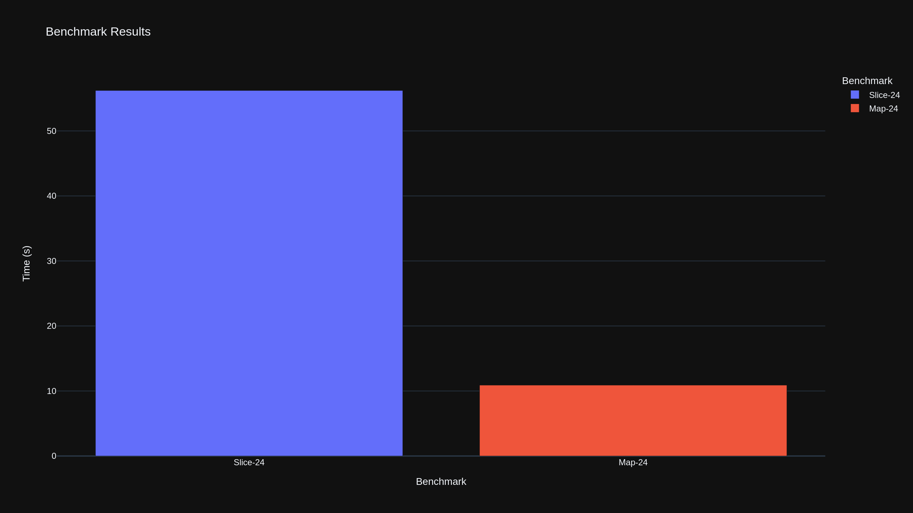

# Example benchmark

This is an example showcasing the use of `gobenchtransform`.

We run the benchmark grabbing the output as CSV:

```bash
go test -bench . | gobenchtransform > bench.csv
```

This allows us to easily plot the results via _plotly_ (see `plot.py`):

```bash
python plot.py
```

The resulting plot looks like this:


